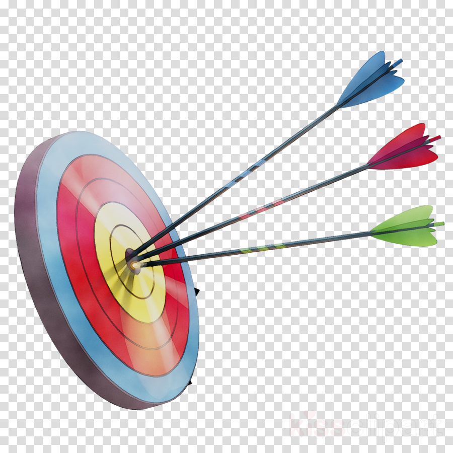

# Bullseye game
- Bullseye is a little and simple bullseye game written in html5, css3 and javascript.

  

## Link: https://rededge967.github.io/bullseye

## Running `Bullseye`
### Running `online`
- open a browser window
- go to https://rededge967.github.io/bullseye

### Running `offline`
- Download the latest version form the releases
- Extract the folder
- Run `index.html` file in your browser

## Gameplay

https://user-images.githubusercontent.com/91379432/155877069-4a1e9ef8-d7ea-428b-bdf9-d9cb6c529a15.mp4

> If you guys played and loved this game, be sure to support this project by starring this repo and fork too...
